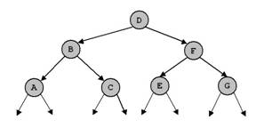
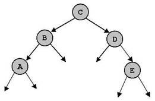

# Exercise 04 - Binary Trees
Note:  You can select and do some options according to your ability only. `We would like to note you that the more questions you do the better for you in doing final practical  and writing exams.

## Writing exercises
## Question 1   
Give the preorder, inorder, postorder,and level-order traversals of the following binary trees.   
(a)   
(b)   
(c)   

## Question 2

For each of the following key sequences create the binary search tree obtained when the keys are inserted one-by-one in the order given into an initially empty tree:

(1) 
```
4, 3, 1, 11, 5, 9, 2, 6, 15, 12.
```

(2) 
```
12, 7, 1, 3, 2, 5, 10, 8, 6, 9. 
```  

Give the preorder, inorder, postorder,and level-order traversals of the created binary trees.   
In (1) delete keys 2, 3 and 11.    
In (2) delete keys 5, 6 and 7. After each time of deleting, give the above traversals.    

## Question 3

For each of the  key sequences in question 2 create the AVL tree obtained when the keys are inserted one-by-one in the order given into an initially empty tree.

Give the preorder, inorder, postorder,and level-order traversals of the created binary trees.

## Question 4   

The  tree  (c) in question 1 is height balanced (AVL). Delete the node  D  and perfom necessary operations so that the tree is still AVL after deletion.   

## Question 5 

Consider a nearly complete binary tree with n nodes.   
a. For what values of  n is a nearly complete binary tree a  full binary tree?   
b. For what values of  n is a nearly complete binary a complete (perfect) binary tree?   

## Question 6   

Suppose we have numbers between  1  and  100 in a binary search tree and we want to search for the number 57 in the tree. Could the following sequence be the sequence of nodes to be examined?

```
2, 90, 63, 70, 68, 72, 57
```

## Practical exercises

## Question 1. `

Write a Java program to implement a binary search tree of integer values with the following operations:
1. `boolean isEmpty()` -   return true if a tree is empty, return false otherwise.
2. `void clear()` - clear a tree.
3. `Node search(int x)` - Search a node having value x. `Return a reference to that node if found, return null otherwise.
4. `void insert(int x)` - check if the key x does not exists in a tree then insert new node with value x into the tree.
5. `void breadth()` - traverse a tree.
6. `void preorder(Node p)` - recursive preorder traverse of a tree.
7. `void inorder(Node p)` - recursive inorder traverse of a tree.
8. `void postorder(Node p)` - recursive postorder traverse of a tree.
9. `int count()` - count and return number of nodes in the tree.
10. `void dele(int x)` - delete a node having value x.
11. `Node min()` - find and return the node with minimum value in the tree. `
12. `Node max()` - find and return the node with maximum value in the tree. `
13. `int sum()` - return the sum of all values in the tree. `
14. `int avg()` - return the average of all values in the tree.
15. The height of a tree is the maximum number of nodes on a path from the root to a leaf node. Write a  function that returns the height of a binary tree.
16. The cost of a path in a tree is sum of the keys of the nodes participating  in that path. `Write a  function that returns the cost of the most expensive  path from the root to a leaf node.
17. Write a  function to determine whether a given binary tree is AVL or not.
18. What value does the following function return when called with each of the binary trees in question 3?
```
int mystery(Node x) {
    if (x == null)
        return 0;
    else
        return max(mystery(x.left), mystery(x.right));
}
```
19. Write a  function to determine whether a given binary tree is a heap.

## Question 2. 
Write a Java program to implement a binary search tree of  string values with operations in the above list.