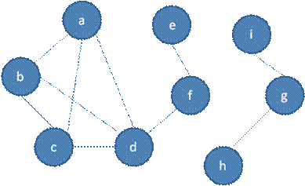
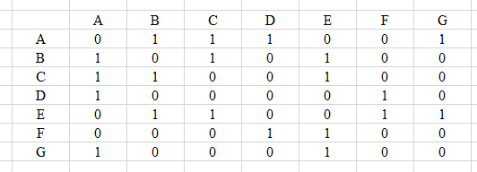
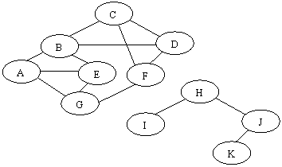
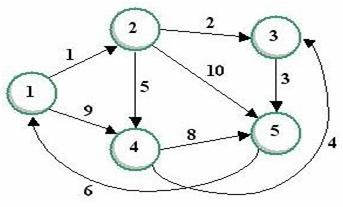
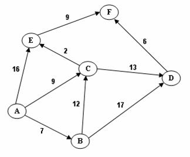
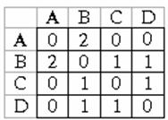
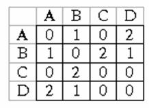
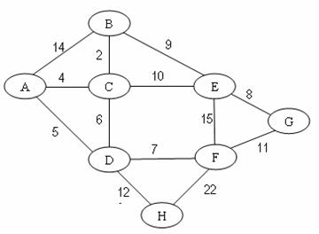
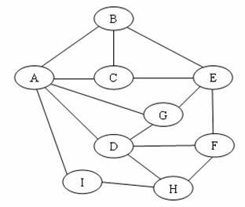

# Exercise 05 - Graph

Note:  You can select and do some questions according to your ability only. We would like to note you that the more questions you do the better for you in doing final practical  and writing exams.

Writing exercises
## Question 1.

Specify the adjacency matrices for the graphs below:


Figure 1. Graph 1

What is the output of  breadth-first traversal from vertex  b? (visit nodes in ABC order if there are some nodes having the same selection ability).

## Question 2.
Given a graph with adjacency matrix below. Draw the graph and show the output of  breadth-first traversal from vertex  A? (visit nodes in alphabetical order if there are some nodes having the same selection ability).



## Question 3.   

Given a graph below. What is the output of  depth-first traversal from vertex  A? (visit nodes in alphabetical order if there are some nodes having the same selection ability).



Figure 2. Graph 2

## Question 4.   

 Given a weighted graph below and you are using the Dijkstra algorithm to find the shortest path from the vertex  1  to the vertex  5. What are the correct order of vertices selected into the set  S until the vertex  5  is selected? (Each step a vertex with minimal current distance is selected into S).


Figure 3. Graph 3

## Question 5. 
Given a weighted graph above and you are using the Dijkstra algorithm to find the shortest path from the vertex  1  to the vertex   5. What is the label of the vertex  4  when the shortest path from 1  to  5   is determined?

## Question 6. 
Given a weighted graph below and you are using the Dijkstra algorithm to find the shortest path from the vertex  A   to the vertex  F. What are the correct order of vertices selected into the set  S until the vertex  F  is selected? (Each step a vertex with minimal current distance is selected into S).


Figure 4. Graph 4

## Question 7. 
Suppose a multigraph G is given by the adjacency matrix below. Determine whether or not  an Euler cycle exists, and if so, provide an example (see the algorithm below).



Suppose the graph G = (V,E) satisfies the conditions for the existence of an Eulerian cycle. The following is an algorithm for finding Euler cycle from the vertex  X  using stack:

```
declare a stack S of characters (a vertex is labeled by a character)
declare an empty array E (which will contain Euler cycle)
push the vertex X to S
while(S is not empty)
{ch = top element of the stack S
if ch is isolated then remove it from the stack and put it to E
else
select the first vertex Y (by alphabet order), which is adjacent
   to ch,push  Y  to S and remove the edge (ch,Y) from the graph  
}
the last array E obtained is an Euler cycle of the graph
```

## Question 8. 
Suppose a multigraph G is given by the adjacency matrix below. Determine whether or not  an Euler path exists, and if so, provide an example.



## Question 9. 
Suppose a multigraph G is given by the adjacency matrix below. Determine whether or not a Hamilton cycle exists, and if so, provide an example  (see the algorithm below).


Figure 5. Graph 5

Given the graph G = (V,E) and X is a vertex of  G. Suppose there exists at least one Hamilton Cycle for the graph. The following is a backtracking  algorithm for finding one Hamilton cycle from the vertex  X:

```
declare an empty array H (which will contain Hamilton cycle)
(1) Put the vertex  X  to  H
(2) Check if H is a Hamilton cycle then stop, else go to (3)
(3) Consider the last vertex Y in H, if there is/are vertex(es) adjacent to Y, select the first adjacent vertex Z (by alphabet order) and put it to H. If there no adjacent vertex, remove Y from H and denote it as a bad selection (so you do not select it in the same way again).
Go to (2).
```

## Question 10. 
Given a weighted graph below. What is the total edge-weight of  the minimum spanning tree  of  G?



Figure 6. Graph 6

## Question 11. 
Given a graph with weighted adjacency below. What is the total edge-weight of  the minimum spanning tree  of  G?
 
 
## Question 12.  
Given a graph below and colors numbered 1, 2, 3, ... are assigned to vertices with the sequential coloring algorithm that orders vertices by alphabetical order (i.e. the vertex labeled  A  comes first, then the vertex B,...)
What is the color of the vertex  H?


Figure 7. Graph 7

## Question 13.
Given a graph above and colors numbered 1, 2, 3, ... are assigned to vertices with the sequential coloring algorithm that orders vertices in decreasing order of their degrees, (i.e. vertices are put in the largest first sequence) 
What is the color of the vertex  H?

## Practical exercises


## Question 1.
Create text files to store the adjancy matrix of a graph in Figure 1. Write the Graph class with  the following members:
Data members:
`int [][] a`  -  two dimentional array representing an adjancy matrix
`String [] label` - label of vertices
`int n` - number of vertices.
Methods:
`void setAMatrix(int [][] b, int m)` - set m to n and b matrix to adjancy matrix.
`void setLabel(String [] c)` - set labels for vertices
and two methods for breadth first traverse and depth first traverse.

## Question 2.
Write the WGraph class which contains weighted matrix and methods for Dijkstra shortest path algorithm.
## Question 3.   
Write the WGraph class which contains weighted matrix and methods for  finding  the minimum spanning tree  of  a graph.
## Question 4.
Write the Graph class which contains adjacency matrix and methods for  assigning colors to vertices with the sequential coloring algorithm.