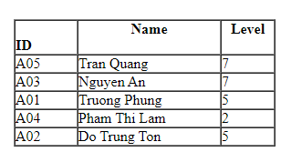

# Exercise 06 - Sorting

Note:  You can select and do some questions according to your ability only. We would like to note you that the more questions you do the better for you in doing final practical  and writing exams.

## Writing exercises

Consider the sequence of integers
```
[8,9,7,9,3,2,3,8,4,6]
```
For each of the following sorting algorithms, draw a sequence of diagrams that traces the execution of the algorithm as it sorts the sequence S: selection sort, insertion sort, bubble sort, quick sort and merge sort.

 Draw a sequence of diagrams that traces the execution of a heap sort of the sequence
```
[89,79,32,38,46,26,43,38,32,79]
```

What are the running times of the above algorithms?


## Practical exercises

### Part 1. Basic sorting



Based on algorithms given in the lecture notes

Create a list of employees (using array) as the above table.
Sort the list in ascending and descending order by ID using different sort algorithms (insertion, selection, bubble).
Hint: Use the Employee class, this class should implement the Comparable interface.

### Part 2. Advanced Sorting
Sort the above list in ascending and descending order by ID using different advanced sort: algorithms: heap sort, quick sort, mergesort,