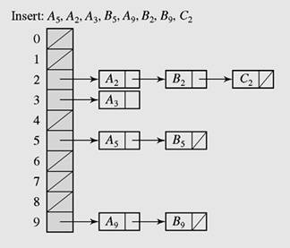

# Exercise 07 - Hashing

Note:  You can select and do some questions according to your ability only. We would like to note you that the more questions you do the better for you in doing final practical  and writing exams.

## Writing Exercises

## Question 1
Give the contents of the hash table that results when you insert items with the keys 

`E A S Y Q U E S T I O N`

 in that order into an initially empty table of `M = 5` lists, using separate chaining with unordered lists. Use the hash function `h(x) =  k mod M` to transform the kth letter of the alphabet into a table index, e.g., `hash(I) = hash(9) = 9 % 5 = 4.`

## Question 2
Give the contents of the hash table that results when you insert items with the keys 

`E A S Y Q U E S T I O N`

in that order into an initially empty table of size `M = 16` using linear probing. Use the hash function  `h(x) = k mod` M to transform the kth letter of the alphabet into a table index.

## Question 3
Give the contents of the hash table that results when you insert items with the keys 

`E A S Y Q U E S T I O N` 

in that order into an initially empty table of size `M = 16` using quadratic hashing. Use the hash function `h(x) = k mod M` for the inital probe and the collision is resolved by finding an available position at `(h(x) + i^2)%M), i=1, 2, ...`

## Question 4
What is the value of the Shift Folding Hash Function if  `K = 432-351-459-763-88` and `TSize = 1000`?

## Question 5
What is the value of the Boundary Folding Hash Function if  `K = 432-351-459-763-88` and `TSize = 1000`?

## Practical exercises
Write a java program to implement  chaining hash table, whereeach position of the table is associated with a linked list or chainof structures whose info fields store keys or references to keys.

(Data about an item is information about a student: name, age, mark. A hash table has size 26 and a hash function transforms name to the the index of the first letter in the ABC order, that is  A and a transformed to  0, b and B to 1,..., and z and Z to 25).  

