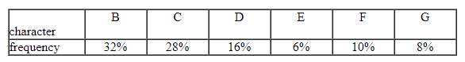

# Exercise 08 - Text processing


Note:  You can select and do some questions according to your ability only. We would like to note you that the more questions you do the better for you in doing final practical  and writing exams.

## Writing exercises

## Question 1. 

Consider the following  code for the letters A through H:

```
A 0
C 1010
E 1100
G 1110
B 100
D 1011
F 1101
H 1111
```

What is the result of  decoding the string: 100010100101101100011010100100000111001111

## Question 2.

Given the character frequencies



a. Using Huffman encoding, what is the code for character  F? (Suppose that when constructing a  sub tree  from 2 nodes we always place node with higher frequency on the left; and the left branch of a node gets value 0, the right one gets value 1)

b. Encode the text   `AABCDEFEEFG`  and calculate the average code length of  this string.

c. Check whether the string  `10010101011011001101010111`  is a valid encoded string of the above codes or not.


## Question 3

What is the maximal length of a codeword possible in a Huffman encoding of an alphabet of n characters?

## Question 4   

Show that a Huffman tree can be constructed in linear time if the alphabet’s characters are given in a sorted order of their frequencies.

## Question 5

Given a raw message

`BBBBBUUUUXXXUUPPPPPPPUUKKKKKKKK`

What is the compressed output if  you  apply the run-length encoding algorithm for that message?

## Question 6

Suppose you are using the LZW algorithm to encode the message  `ABBABABACCDABCCDB`  and  contents of the dictionary at the beginning of encoding are:

(1) A   (2) B  (3) C  (4) D

After the encoding process completed:

a. What strings are contained in the dictionary?
b. What is the compressed string?
 

## Practical exercises

## Question 1. 

Write  Java programs to perform the tasks related with Huffman coding algorithm as follows:

1. Given a set of  characters with frequencies (or probabilities), create the Huffman code binary tree.

2. Calculate frequencies of all characters contained in the text file and create the Huffman code binary tree for all characters contained in the text file.

3. Given a Huffman code tree. Print  codewords of  all leaf nodes.

## Question 2. 

Write  Java programs to perform the tasks related with LZW coding algorithm as follows:

1. Given a string to be encoded. Create the dictionary for LZW encoding algorithm.

2. Given a string to be encoded. Create the array representing the compressed output of the string for LZW encoding algorithm (elements of the array are the indexes in the dictionary created in the decoding process).
