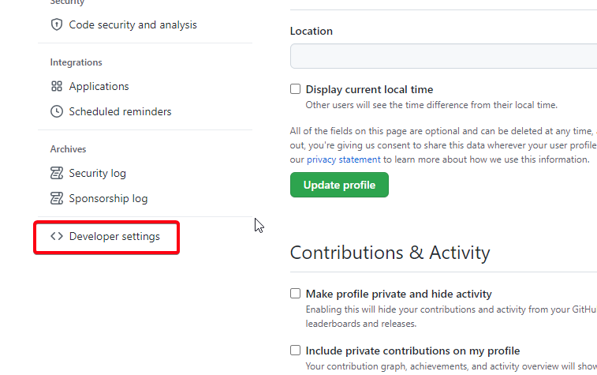
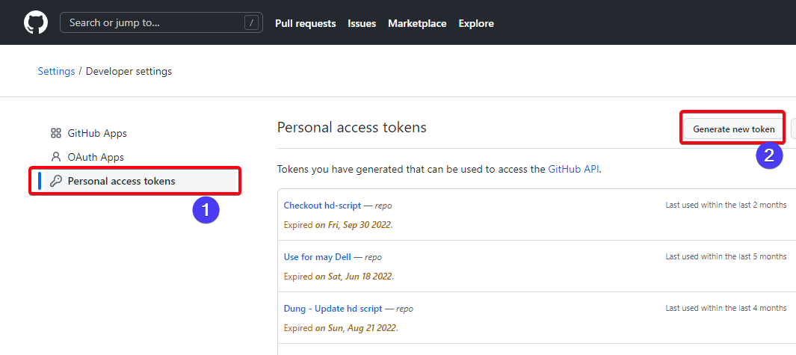
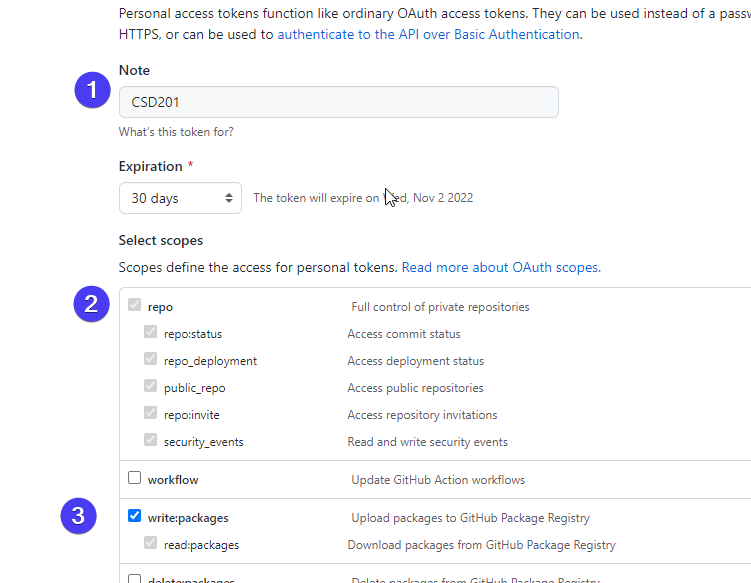
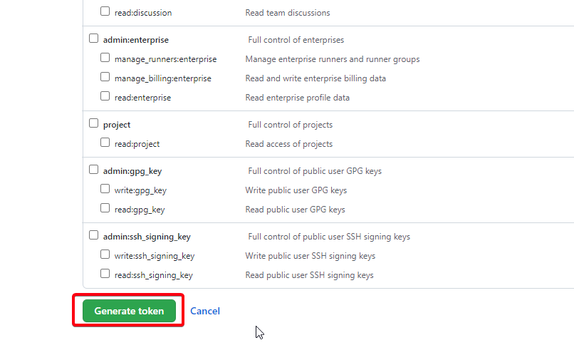
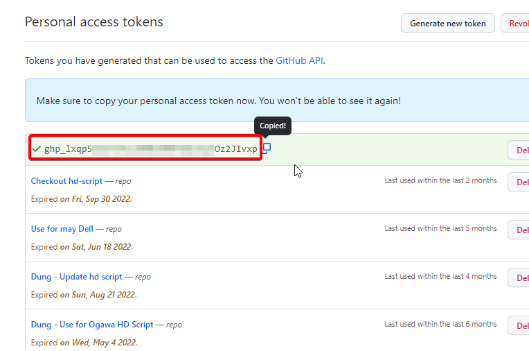
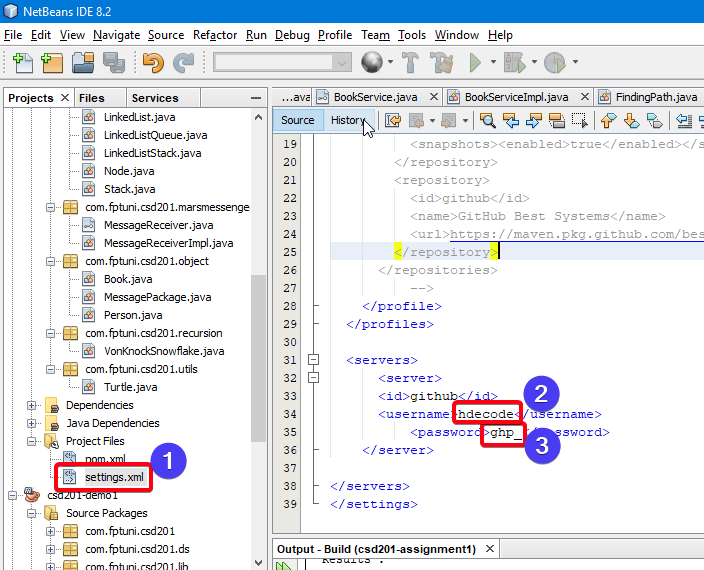

# Assignment 1

## Introduction

CSD201 - Assignment 1

This is your first assigment in this course. You choose ONLY ONE topic to develop the solution.


## TOPIC 1 - MARS MESSENGER


You are employed by SpaceX to develop a library to communicate between the team on Earth to the Spaceship to Mars. There are many interferences in the communication, so SpaceX needs you to develop a stable solution in which no message loses in data transfer.

The spaceship which goes to Mars will send a full message divided into several packages, so you are reponsible for consolidating all packages to a full message, then the SpaceX team can understand the information from spaceship

For example:

- The spaceship sends a message "HELLO THE EARTH. WE FIND ALIEN ON MARS. BE PREPARED"
- The message is divided to 3 packages:
```
{   id: 0,
    content: "HELLO THE EARTH. ",
    size: 17
}

{   id:1,
    content: "WE FIND ALIEN ON MARS. ",
    size: 23
}

{   id: 2,
    content: "BE PREPARED",
    size: 11
}
```
- Your library needs to combine 3 packages to one full message. "HELLO THE EARTH. WE FIND ALIEN ON MARS. BE PREPARED"


### HERE ARE YOUR TASKS

Develop a library which implement the interface MessageReceiver:

```
class MessagePackage{   // 1
    int index;
    String content;
    int size;
}

interface MessageReceiver {
    void receive(MessagePackage);  // Q1,2
    String getMessage();  // Q1,2
    int[] getMissingIndex(); // Q3

}
```
### TASK 1
When the spaceship is near the earth, the order of packages is always correct. So you will get all packages with index in order like 0,1,2,3. Develop `class MessageReceiverImpl` receive all packages in order and return the message. (2 points)

For a test example,
```
class MessageReceiverImpl implements MessageReceiver{

}

void main (){
    
    MessageReceiverImpl mylib = new MessageReceiverImpl();
    mylib.receive(packpage0);
    mylib.receive(packpage1);
    mylib.receive(packpage2);
    System.out.println(mylib.getMessage());
}

```

### TASK 2

When the spaceship is near the moon, the order of packages is changing. So you will get all packages with index in a random order like 2,0,1,3. Develop `class MessageReceiverImpl` receive all packages (in correct order or incorrect order) and return the message. (2 points)

For a test example,

```
class MessageReceiverImpl implements MessageReceiver{

}

void main (){
    
    MessageReceiverImpl mylib = new MessageReceiverImpl();
    mylib.receive(packpage2);
    mylib.receive(packpage0);
    mylib.receive(packpage1);
    System.out.println(mylib.getMessage());
}

```

### TASK 3
When the spaceship is on the way to Mars, some of packages are missing. So you will not have all packages. Develop the `class MessageReceiverImpl` receive all packages (in correct order or incorrect order) and return indexes of missing package - `getMissingIndex()`. (2 points)

### TASK 4
Based on the library's return values of missing packages, the Spaceship will send again  missing packages, they may send the same packages once or twice or triple. Update the function `receive()` to update missing packages and return the message in **allowed time**. (note the number of packages  is possibly in thousands) (2 points)

### TASK 5
Some packages are well received but they are not correct, to check if the package is error, the program will check if `content.length` equals `size`.    
To reduce the time of the comunication, the library needs to fix the package if possible. To fix the package, it needs to realise what missing part in the content and then merge all error contents to one correct content. Please note that the error packages lack either head or tail of the content. (2 points)

For example, error package

```
{   id:0,
    content:"HELLO THE E",
    size: 17
}

{   id:0,
    content:" THE EARTH. ",
    size:17
}
```

The correct package
```
{   id:0,
    content:"HELLO THE EARTH.",
    size: 17
}

```
Update the function receive() to receive the error packages and return message.


### TASK ASSESSMENT

Each task will be tested with 5 - 10 test cases. The test cases are designed for normal cases, special cases, big data cases. The points will be calculated based on passed test cases.

You may be asked to modify immediately and to explain your assignment in the interview to be sure that you are really the author  of the assignment you submitted.


## TOPIC 2 CURIOUS - MARS EXPLORER

You are assigned an important task to develop the intelligent brain for the **CURIOUS - MARS EXPLORER**. The basic functions of Curious are

```

class Curious {

    turnLeft(); // turn 90 degree to left
    turnRight(); // turn 90 degree to right
    boolean move(); //move one step, return true if it can move.
    boolean moveBack(); //move one step back, return true if it can move.
    int[] getLocation(); // return current position, 0: x, 1:y
    void start(int map); //go to the start position
    boolean isWater(); // return true when the Curious find Water
    void showMap(); // draw map

}
```

### YOUR TASK
Develop a program which used Curious to find out Water on Mars. The program just call Curious functions to control it from the start position to find water. If the Curious finds water, the program should announce the result. Note that the program has to find water in allowed time.

For test example 

```
void main (){
    Curious explorer = new Curious();
    explorer.start(1); // map is the map for testing 1,2,3,4
    explorer.showMap();
    while (!curious.isGold()){
        if (!curious.move()){
            curious.turnRight();
        };
    }
}
```

### TASK ASSESSMENT

Task will be tested with 10 test cases (1 point for 1 test case). The test cases are designed for normal cases, special cases, big data cases. The points will be calculated based on passed test cases.

You may be asked to modify immediately and to explain your assignment in the interview to be sure that you are really the author  of the assignment you submitted.

### BASE SOURCE CODE

1. Students download or check out source code Assignment 1 on GitHub at https://github.com/dunghuynh-teaching/csd201-demo/

2. Copy all source code the following folders and files at `src\main\java\com\fptuni\csd201` to your exercise source code

```
curious
marsmessenger
object
Main.java
```

3. Generate your Github token

Step 1: Go to settings


Step 2: Go to Developer Settings



Step 3: Go to Personal Access Token and Generate New token



Step 4: Enter information as the follows and click Generate token





Step 5: Copy the token 



Step 6: Goto settings.xml in NetBeans and add/update the username and password. If you do not see <server> tag, add it to your file.

```
  <servers>
      <server>
        <id>github</id>
        <username>===github id===</username>
        <password>===tolken====</password> 	  
      </server>  
</servers>

```




